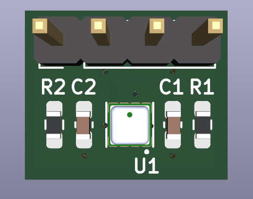
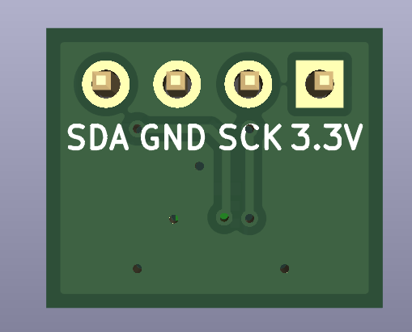
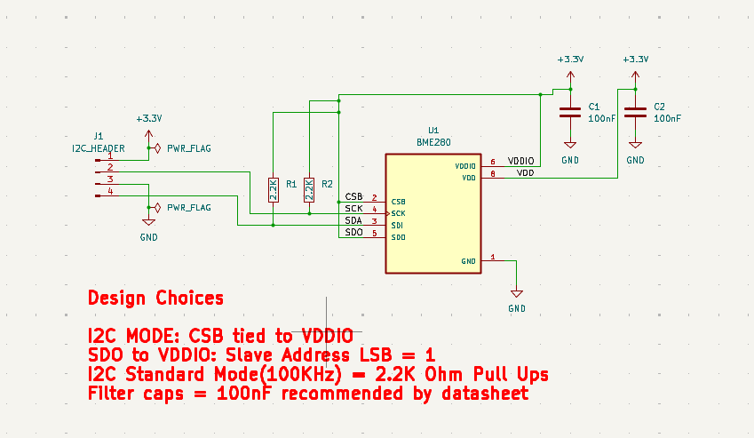
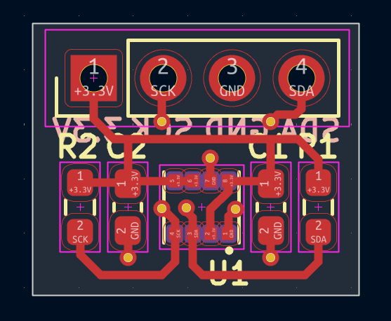
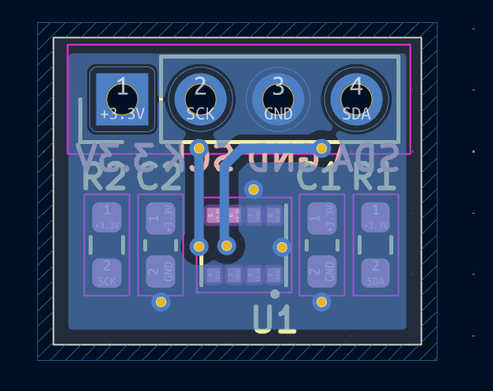
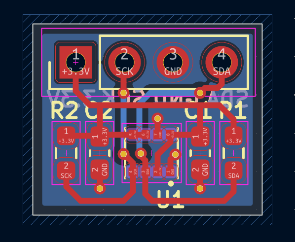

# BME280 Environmental Sensor Breakout Module

An ultra-compact ($12 \times 10\,\text{mm}$) hardware breakout board for the **Bosch BME280** humidity, pressure, and temperature sensor. Designed in KiCad, this board breaks out the essential I2C signals to a standard $2.54\,\text{mm}$ header for seamless integration into low-power embedded systems and microcontroller prototyping.

## 3D Board Renders

| Top View | Bottom View |
| :---: | :---: |
|  |  |

---

## Technical Specifications

| Parameter | Value / Description |
| :--- | :--- |
| **Dimensions** | $12\,\text{mm} \times 10\,\text{mm}$ |
| **Supply Voltage ($V_{DD}$ / $V_{DDIO}$)** | $3.3\,\text{V}$ DC |
| **Communication Interface** | I2C (Hardwired) |
| **I2C Slave Address** | `0x77` (`SDO` pulled HIGH to $V_{DDIO}$) |
| **I2C Pull-Up Resistors** | $2.2\,\text{k}\Omega$ (Supports Standard & Fast Mode) |
| **Header Pitch** | $2.54\,\text{mm}$ ($100\,\text{mil}$) |
| **Passives Form Factor** | 0603 (1608 Metric) |
| **EDA Software** | KiCad EDA v10.0.4 |

---

## Pinout Configuration

The module features a 4-pin header interface designed for easy breadboard or jumper cable hookup:

| Header Pin | Label | Type | Schematic Net | Description |
| :---: | :--- | :--- | :--- | :--- |
| **1** | `3.3V` | Power | `+3.3V` | Main Power Supply ($3.3\,\text{V}$) |
| **2** | `SCK` | Input | `SCK` / `SCL` | I2C Serial Clock line |
| **3** | `GND` | Power | `GND` | System Ground Reference |
| **4** | `SDA` | I/O | `SDA` | I2C Serial Data line |

> **Note on Crosstalk:** Placing Ground (`GND`) between `SCK` and `SDA` on the physical pin header provides physical shielding against signal crosstalk across external cables.

---

## Schematic & Hardware Design

### Design Choices
* **Hardwired I2C Mode:** Pin 2 (`CSB`) is connected directly to $V_{DDIO}$ ($+3.3\,\text{V}$), permanently selecting the I2C interface protocol and disabling SPI.
* **Slave Address Selection:** Pin 5 (`SDO`) is tied to $V_{DDIO}$, setting the default 7-bit I2C address to **`0x77`**.
* **Bus Termination:** $2.2\,\text{k}\Omega$ pull-up resistors ($R_1, R_2$) are included on both `SDA` and `SCK` lines to guarantee fast rise times ($t_r < 300\,\text{ns}$) for 400 kHz Fast-Mode I2C operation.
* **Power Supply Decoupling:** Dedicated $100\,\text{nF}$ ceramic decoupling capacitors ($C_1, C_2$) are placed close to the $V_{DD}$ and $V_{DDIO}$ power pins to filter high-frequency noise and voltage ripple.

---

## PCB Layout

| Top Layer (F.Cu) | Bottom Layer (B.Cu) | Combined Stackup |
| :---: | :---: | :---: |
|  |  |  |

---

                                    # Project Documentation
